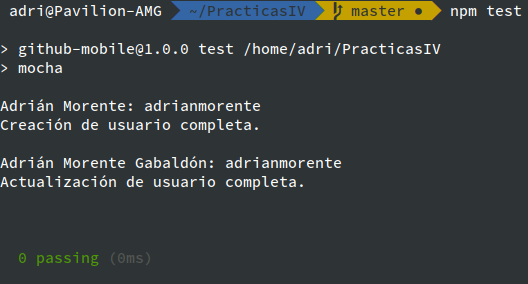

# Tema 2 - Ejercicio 2

- Para empezar con el testeo de funcionalidades de nuestra aplicación, comenzaremos por el nivel más bajo, **el de las aserciones**. Usaremos la librería estándar de JS (`assert`) tal que así:

```js
// test/user.js
var user = require('./../models/user.js');
var assert = require('assert');

// testing the creation of an user
var new_user = new user.User('Adrián','Morente','adrianmorente');
assert(new_user, "Usuario creado");
console.log(new_user.as_string());
assert.equal(new_user.as_string(), "Adrián Morente: adrianmorente", "Creado");
console.log("Creación de usuario completa.\n");
```

- En este ejemplo creamos un nuevo usuario del modelo previamente definido, y a continuación testeamos la creación con el método ***as_string()***, que deberemos implementar, y que será el que nos verifique (en forma de salida de texto) si se han introducido correctamente los datos en el usuario creado.

```js
// models/user.js

function User(firstname, lastname, gh_user){
  this.firstname = firstname;
  this.lastname = lastname;
  this.gh_user = gh_user;
};

User.prototype.as_string = function userToString(){
  return this.firstname + " " + this.lastname + ": " + this.gh_user;
};

module.exports = {
  User
};
```

***

- Por otro lado, otra aserción podría ser, en lugar de la que verifica la creación de un usuario; una que compruebe una actualización de algún atributo propio; como podría ser:

```js
// testing the update of an user
new_user.setLastName = "Morente Gabaldón";
console.log(new_user.as_string());
assert.equal(new_user.as_string(), "Adrián Morente Gabaldón: adrianmorente", "Actualizado");
console.log("Actualización de usuario completa.\n");
```

- Finalmente, el resultado de ambas aserciones (si hemos definido bien el modelo, claro) es el siguiente:


