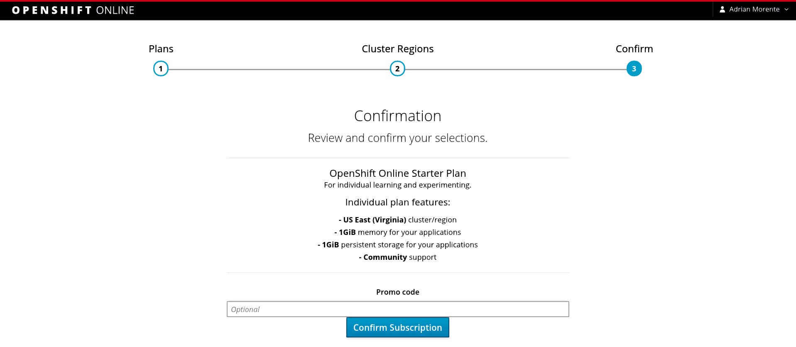
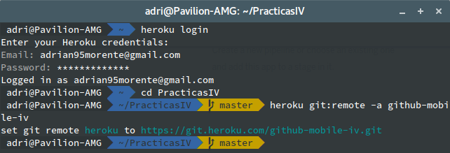

# Tema 2 - *Platform as a Service*.

## Ejercicio 1 - Prueba de PaaS y registro

Mi sistema de microservicios va a estar realizado en Javascript principalmente, de forma que podría elegir entre [ZEIT.co](https://zeit.co/), [Heroku](https://www.heroku.com/) y/o [Openshift](https://www.openshift.com/).

###### Openshift

- Pese a tener años de historia, parece que no está pasando por buen momento y está dando algunos fallos de registro e inicio de sesión a muchos usuarios. Por mi parte no tuve esos fallos, pero vi algunos issues *en alerta* en su código así que preferí optar por otra cosa.

###### Heroku

- En cuanto a Heroku, puede ser quizás la opción más considerable en cuanto a funcionamiento (y la interfaz es *nice & clean* y muy agradable al usuario). Sin embargo, solo ofrece 21 horas de servicio continuado al día; y busco una plataforma que me permita un servicio 24/7.

###### Zeit.co

- Es una plataforma un poco singular ya que solo permite contenedores sobre Javascript. Además, la instalación del cliente (`now`) se hace rápidamente con `npm` y a su vez éste genera el registro de usuario. Por cambiar un poco, elegiré este personalmente.

Tanto el login como el despliegue se hacen mediante línea de comandos. Con `now -h` consultamos todas las opciones disponibles. Además, en su documentación en la web enseñan a hacer despliegues de webs estáticas, de proyectos en Node.JS y de contenedores Docker.

***

## Ejercicio 2 - Crear una aplicación en el PaaS elegido y realizar despliegue de prueba

Como vemos en la documentación de [`zeit`](https://zeit.co/docs/getting-started/deployment#node.js-deployment), basta con tener un archivo ***package.json*** para que el cliente interprete que se trata de un microservicio bien hecho con Node. Usaremos el ejemplo propuesto en dicha documentación, que se basa en la herramienta [`micro`](https://github.com/zeit/micro).

Los fuentes del ejemplo están en la carpeta [ejemplo-despliegue-zeit](./ejemplo-despliegue-zeit), así como el archivo `package.json`, gracias al cual con ejecutar `npm install` ya tendremos las dependencias con las que lanzar la aplicación.

Una vez tenemos eso, basta con ejecutar `$ now` en el directorio donde esté el `package.json` correspondiente al proyecto y obtendremos la siguiente salida (*si todo va bien*):

***
